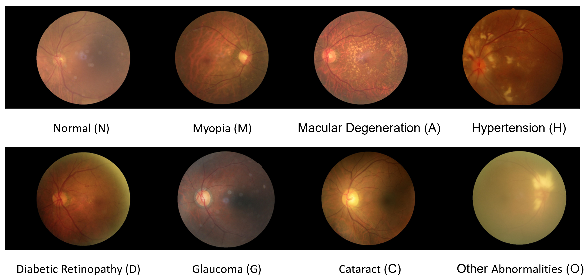
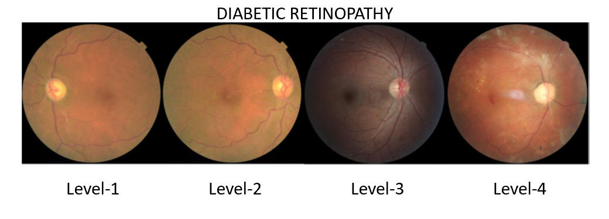

# Diagnosis of Diseases in Color Fundus Images Using Deep Learning Algorithms
According to the World Health Organization, there are one billion people with vision impairments. Among these individuals, 65.2 million suffer from cataracts, 6.9 million from glaucoma, 3 million from diabetic retinopathy, and 4.2 million from vision problems due to corneal opacities.
Eye diseases such as cataracts, glaucoma, diabetic retinopathy, age-related macular degeneration, hypertension, and pathological myopia can result in blindness if left untreated. Early diagnosis of these diseases can prevent the progression of vision impairments. To accelerate the early diagnosis process in these potentially blinding diseases, we aimed to develop this project.

In our study, we aim to develop an explainable artificial intelligence-supported, deep learning-based model that can reliably predict eye diseases and classify their severity from color fundus images.

## Dataset
We will utilize two different datasets for the project, obtained from the Kaggle platform.
In the initial phase, we will use the <b>['Ocular Disease Recognition (ODIR)'](https://www.kaggle.com/datasets/andrewmvd/ocular-disease-recognition-odir5k)</b> dataset, containing fundus images of the right and left eyes from 4784 patients. These fundus images consist of eight classes: normal (N), myopia (M), hypertension (H), diabetic retinopathy (D), cataract (C), glaucoma (G), age-related macular degeneration (A), and other abnormalities/diseases (O).

In the second phase, we will use the <b>['Diabetic Retinopathy'](https://www.kaggle.com/datasets/tanlikesmath/diabetic-retinopathy-resized)</b> dataset containing fundus images of the right and left eyes from 17554 patients to predict the severity of diabetic retinopathy. The disease is labeled in the dataset from 1 (lowest) to 4 (highest stage), reflecting the four stages of diabetic retinopathy.

## Methodology

As the fundus images in our datasets are labeled, we will train using a supervised learning approach.
In the field of medical image recognition, the backbone of models that yield the most successful results is the CNN algorithm. We will train fundus images using a layered structure with Convolutional Neural Network algorithms.
During the model's training, we will utilize a loss function. Cross-entropy loss function is generally used in multi-classification problems. As both parts of our project involve multi-classification problems, we will use the cross-entropy loss function.
We will initialize our models using pre-trained weights from models trained on extensive datasets like ImageNet. These models have learned low-level features in images and prevent the model from overfitting during training, providing quicker results and higher accuracy.
Initially, we plan to use a 16-layer VGGNet architecture in the project. If the 16-layer Vgg architecture is insufficient to distinguish features in eye diseases, we will use deeper architectures like Vgg-19, DenseNet.
Neural network-based architectures are models with complex and high numbers of hidden layer structures, making them challenging to interpret. Therefore, they are termed 'black boxes.' In this study, we will add a Grad-cam algorithm to the architecture, contributing to understanding the decisions made by these structures. The Grad-cam algorithm will allow us to observe which parts of the fundus images were decisive in the classification of eye diseases.

## Technologies

- Numpy
- Pandas
- Scikit-learn
- Matplotlib
- Seaborn
- Tensorflow
- Keras
- Jupyter Notebook
